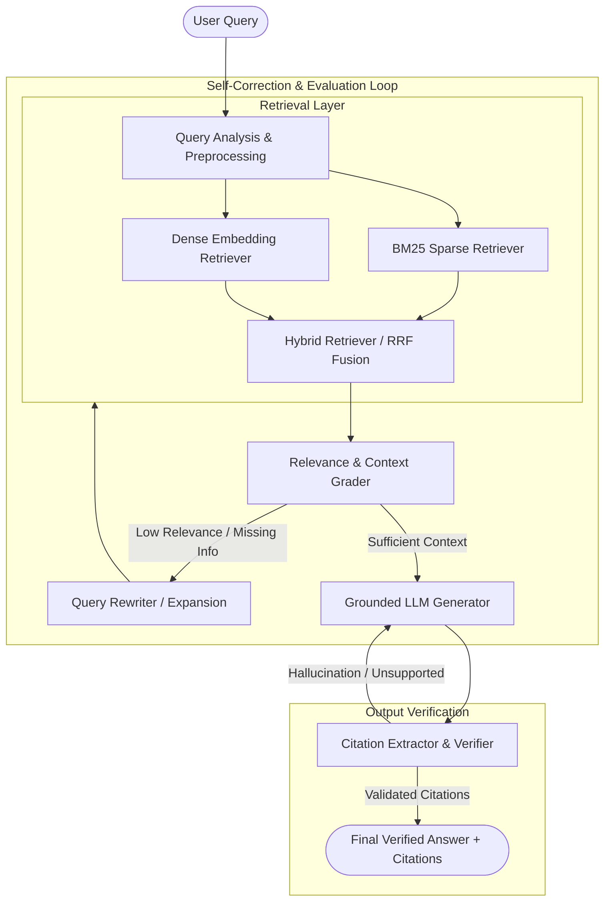

# Self-Correcting RAG Pipeline

A production-grade, modular Retrieval-Augmented Generation (RAG) system with hybrid search (BM25 + Dense embeddings), grounded citation verification, and self-correction / fallback mechanisms.

---

## Architecture Overview



---

## Key Features

- **Hybrid Search**: Combines keyword-level precision (BM25) and semantic vector understanding (Dense embeddings via SentenceTransformers).
- **Self-Correction & Fallbacks**: Evaluates context sufficiency before answering; rewrites queries or falls back to supplementary search when retrieved context is inadequate.
- **Citation Verification**: Parses structured document citations (e.g., `[doc_001]`) and validates that all generated claims map directly to retrieved source documents.
- **Comprehensive Evaluation Suite**: Benchmark dataset and standardized ranking metrics (`Recall@k`, `MRR@k`, `NDCG@k`) for empirical retrieval evaluation.

---

## Repository Structure

```text
self-correcting-rag/
├── data/
│   └── benchmark_dataset.json      # Curated AI/ML QA benchmark with ground-truth document mappings
├── src/
│   ├── retrieval/
│   │   ├── bm25.py                 # BM25Okapi sparse lexical retriever
│   │   ├── denseretriever.py       # Dense semantic retriever using SentenceTransformers
│   │   └── hybridretriever.py      # Hybrid retriever combining sparse + dense scoring
│   └── utils/
│       └── metrics.py              # Retrieval & citation evaluation metrics (Recall@k, MRR@k, NDCG@k)
├── requirements.txt                # Python package dependencies
├── LICENSE                         # Apache 2.0 License
└── README.md                       # Project documentation
```

---

## Current Status & Roadmap

- [x] **Benchmark Dataset**: Curated domain-specific Q&A pairs with ground truth document IDs (`data/benchmark_dataset.json`).
- [x] **BM25 Sparse Retrieval**: Tokenization and BM25Okapi scoring (`src/retrieval/bm25.py`).
- [x] **Dense Semantic Retrieval**: Vector indexing and cosine similarity with `all-MiniLM-L6-v2` (`src/retrieval/denseretriever.py`).
- [x] **Retrieval & Citation Metrics**: `Recall@k`, `MRR@k`, `NDCG@k`, and citation consistency checking (`src/utils/metrics.py`).
- [ ] **Hybrid Search Fusion**: Reciprocal Rank Fusion (RRF) / weighted score combination (`src/retrieval/hybridretriever.py`).
- [ ] **Context & Relevance Grader**: Evaluating retrieval relevance and detecting knowledge gaps.
- [ ] **Query Rewriting & Expansion**: Re-formulating ambiguous or poorly performing queries.
- [ ] **Grounded Generation & Self-Correction**: Enforcing citation attribution and iterative refinement.

---

## Getting Started

### Prerequisites

- Python 3.10+
- `pip` or standard virtual environment manager

### Installation

1. **Clone the repository**:
   ```bash
   git clone https://github.com/aryash45/Self-Correcting-Rag-Pipeline.git
   cd Self-Correcting-Rag-Pipeline
   ```

2. **Create and activate a virtual environment**:
   ```bash
   python -m venv venv
   # On Windows:
   venv\Scripts\activate
   # On macOS/Linux:
   source venv/bin/activate
   ```

3. **Install dependencies**:
   ```bash
   pip install -r requirements.txt
   ```

---

## Quickstart & Usage

### 1. BM25 Retrieval

```python
import json
from src.retrieval.bm25 import BM25Retriever

with open("data/benchmark_dataset.json", "r") as f:
    data = json.load(f)

documents = data["documents"]
retriever = BM25Retriever(documents)

results = retriever.retrieve("What is low rank adaptation for parameter efficient fine-tuning?", k=3)
for doc in results:
    print(f"[{doc['id']}] {doc['title']}")
```

### 2. Dense Semantic Retrieval

```python
import json
from src.retrieval.denseretriever import DenseRetriever

with open("data/benchmark_dataset.json", "r") as f:
    data = json.load(f)

documents = data["documents"]
retriever = DenseRetriever(documents, model_name="all-MiniLM-L6-v2")

results = retriever.retrieve("How does KV cache compression work in modern transformers?", k=3)
for r in results:
    print(f"[{r['document']['id']}] (Score: {r['score']:.4f}) {r['document']['title']}")
```

### 3. Evaluation Metrics

```python
from src.utils.metrics import recall_at_k, mrr_at_k, ndcg_at_k, extract_citiations, verify_citiations

# Retrieved document IDs vs. Ground truth
retrieved = ["doc_001", "doc_004", "doc_002"]
ground_truth = ["doc_001"]

print(f"Recall@3: {recall_at_k(retrieved, ground_truth, k=3):.2f}")
print(f"MRR@3:    {mrr_at_k(retrieved, ground_truth, k=3):.2f}")
print(f"NDCG@3:   {ndcg_at_k(retrieved, ground_truth, k=3):.2f}")

# Citation verification
response_text = "LoRA reduces parameters significantly [doc_001]."
citations = extract_citiations(response_text)
print("Valid citation:", verify_citiations(citations, ground_truth))
```

---

## Evaluation Benchmark

The benchmark dataset in [`data/benchmark_dataset.json`](file:///c:/Users/aryash/Downloads/Virtual%20try%20on/self-correcting-rag/data/benchmark_dataset.json) contains complex, technical machine [...]

---

## License

This project is licensed under the Apache License 2.0 - see the [LICENSE](file:///c:/Users/aryash/Downloads/Virtual%20try%20on/self-correcting-rag/LICENSE) file for details.
